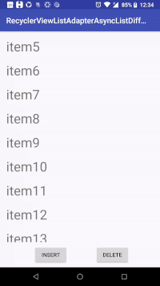

# RecyclerViewListAdapterAsyncListDiffDemo

This is a demo of using new recyclerView's [ListAdapter](https://developer.android.com/reference/android/support/v7/recyclerview/extensions/ListAdapter.html) using Kotlin. Demo shows simple insert delete operation. This List adapter uses new [AsyncListDiffer](https://developer.android.com/reference/android/support/v7/recyclerview/extensions/AsyncListDiffer.html) inside. AsyncListDiffer calculates the diffs of list item differences asynchronously. So, no need to worry about any threading implementation.

those [ListAdapter](https://developer.android.com/reference/android/support/v7/recyclerview/extensions/ListAdapter.html) & [AsyncListDiffer](https://developer.android.com/reference/android/support/v7/recyclerview/extensions/AsyncListDiffer.html) are available from support library 27.1.0. So, consider to update it before using it.




## prerequisite
need knowledge about [RecyclerView](https://developer.android.com/reference/android/support/v7/widget/RecyclerView.html) & [DiffUtil.Callback](https://developer.android.com/reference/android/support/v7/util/DiffUtil.Callback.html)


## Advantage
1. Less code
2. No need to worry about threading during comparing diffs

## Disadvantage
you can not update any data in same list. Always need to pass a new list inside adapter to update your views. This is due to inside [AsyncListDiffer](https://developer.android.com/reference/android/support/v7/recyclerview/extensions/AsyncListDiffer.html) there is a checking that if it founds old list reference it ommits the calculations of DiffUtil.Callback.
```
public void submitList(final List<T> newList) {
        if (newList == mList) {
            // nothing to do
            return;
        }

        // rest of the code
}
```

